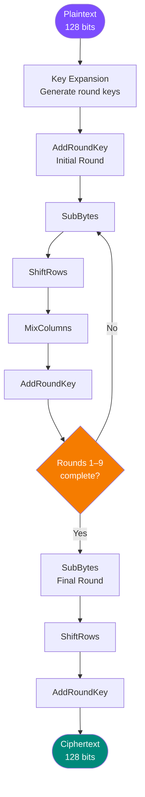
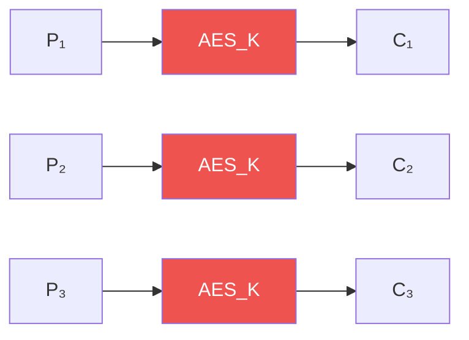
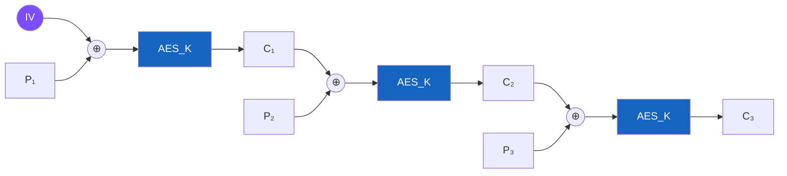
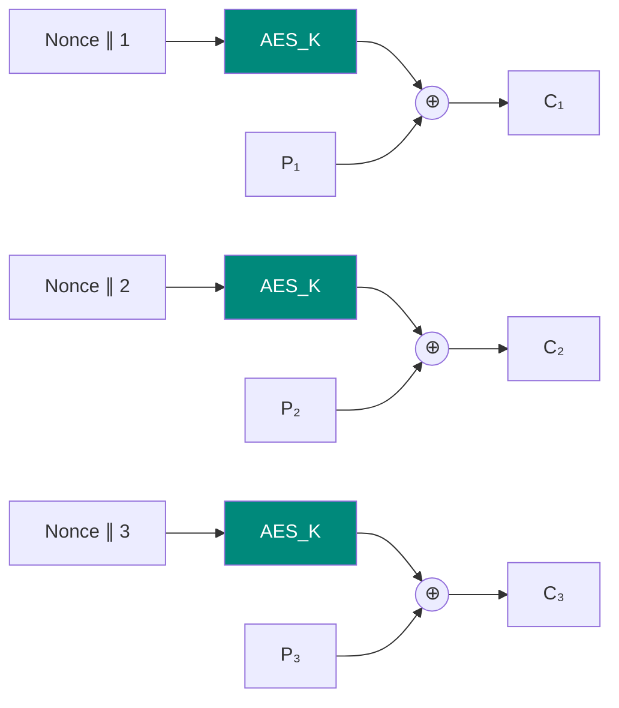
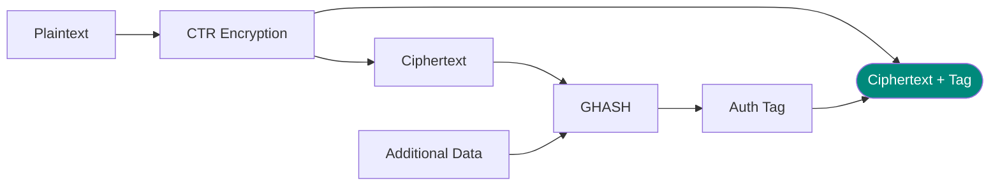

# AES and Block Ciphers

## What is a Block Cipher?

A **block cipher** encrypts data in **fixed-size blocks** (e.g., 128 bits at a time).

**Contrast with stream ciphers:** Process one bit/byte at a time

### Key Properties

1. **Deterministic**: same plaintext block → same ciphertext block (with same key)
2. **Reversible**: encryption and decryption are inverse operations
3. **Confusion & Diffusion**: Claude Shannon's principles

---

## AES (Advanced Encryption Standard)

### Overview

**AES** is the **standard symmetric block cipher** used everywhere today.

- **Block size:** 128 bits (16 bytes)
- **Key sizes:** 128, 192, or 256 bits
- **Rounds:** 10, 12, or 14 (depending on key size)

**History:**

- Replaced DES in 2001
- Winner of NIST competition
- Original name: Rijndael

---

## AES Structure

### High-Level Flow



---

## The State

AES organizes the 128-bit block as a **4×4 matrix of bytes** (called the **state**).

```
┌─────┬─────┬─────┬─────┐
│ s₀₀ │ s₀₁ │ s₀₂ │ s₀₃ │
├─────┼─────┼─────┼─────┤
│ s₁₀ │ s₁₁ │ s₁₂ │ s₁₃ │
├─────┼─────┼─────┼─────┤
│ s₂₀ │ s₂₁ │ s₂₂ │ s₂₃ │
├─────┼─────┼─────┼─────┤
│ s₃₀ │ s₃₁ │ s₃₂ │ s₃₃ │
└─────┴─────┴─────┴─────┘
```

Each cell is **1 byte** (8 bits).

---

## AES Operations

### 1. SubBytes (Confusion)

Replace each byte with another byte from the **S-box** (substitution box).

**Purpose:** Non-linear transformation (provides confusion)

$$s'_{i,j} = \text{S-box}[s_{i,j}]$$

**Example:**

- Input byte: `0x53`
- S-box lookup: `0xED`
- Output byte: `0xED`

**S-box properties:**

- Non-linear (based on multiplicative inverse in GF(2⁸))
- Designed to resist differential and linear cryptanalysis

---

### 2. ShiftRows (Diffusion)

Cyclically shift the rows of the state:

- **Row 0:** No shift
- **Row 1:** Shift left by 1
- **Row 2:** Shift left by 2
- **Row 3:** Shift left by 3

```
Before:                After:
┌────────────────┐    ┌────────────────┐
│ s₀₀ s₀₁ s₀₂ s₀₃│    │ s₀₀ s₀₁ s₀₂ s₀₃│  (no shift)
│ s₁₀ s₁₁ s₁₂ s₁₃│    │ s₁₁ s₁₂ s₁₃ s₁₀│  (shift 1)
│ s₂₀ s₂₁ s₂₂ s₂₃│ →  │ s₂₂ s₂₃ s₂₀ s₂₁│  (shift 2)
│ s₃₀ s₃₁ s₃₂ s₃₃│    │ s₃₃ s₃₀ s₃₁ s₃₂│  (shift 3)
└────────────────┘    └────────────────┘
```

**Purpose:** Spreads bytes across columns (diffusion)

---

### 3. MixColumns (Diffusion)

Mix each **column** independently using matrix multiplication in GF(2⁸).

$$\begin{bmatrix} s'_{0,j} \\ s'_{1,j} \\ s'_{2,j} \\ s'_{3,j} \end{bmatrix} = \begin{bmatrix} 2 & 3 & 1 & 1 \\ 1 & 2 & 3 & 1 \\ 1 & 1 & 2 & 3 \\ 3 & 1 & 1 & 2 \end{bmatrix} \begin{bmatrix} s_{0,j} \\ s_{1,j} \\ s_{2,j} \\ s_{3,j} \end{bmatrix}$$

**Purpose:** Each output byte depends on all 4 input bytes (diffusion)

**Note:** Multiplication is in **GF(2⁸)**, not regular integers!

---

### 4. AddRoundKey (Key Mixing)

XOR the state with the round key.

$$s'_{i,j} = s_{i,j} \oplus k_{i,j}$$

**Purpose:** Incorporate the secret key

---

## Galois Fields GF(2⁸)

### Why Galois Fields?

AES does math on **bytes** (8-bit chunks). But AES needs to:

- **Multiply bytes** (for MixColumns)
- **Find inverses** (for S-box)

Regular arithmetic doesn't work well for cryptography. **Galois Fields** provide the right structure.

---

### GF(2⁸) Basics

Elements of GF(2⁸):

- All 8-bit values: `0x00` to `0xFF`
- Represented as polynomials of degree < 8

**Example:** `0x53` = $x^6 + x^4 + x + 1$

---

### Addition in GF(2⁸)

Addition = **XOR**

$$a + b = a \oplus b$$

**Example:**
```
  0x53 = 01010011
⊕ 0xCA = 11001010
  ──────────────
  0x99 = 10011001
```

---

### Multiplication in GF(2⁸)

Multiply polynomials, then **reduce modulo** an irreducible polynomial.

**AES uses:** $m(x) = x^8 + x^4 + x^3 + x + 1$

**Example:** $0x53 \times 0xCA$ in GF(2⁸)

1. Multiply polynomials
2. Reduce mod $m(x)$
3. Result (in GF(2⁸))

**Special case: multiply by 2:**

- If MSB = 0: left shift
- If MSB = 1: left shift, then XOR with `0x1B`

---

## Key Expansion

AES takes **one original key** and expands it into multiple **round keys**.

**For AES-128:**

- Original key: 128 bits (16 bytes)
- Need: 11 round keys (176 bytes total)

**Process:**

1. Copy original key as first 4 words
2. Generate new words using:

   - **RotWord** - circular byte rotation
   - **SubWord** - S-box substitution
   - **Rcon** - round constant XOR

---

## AES Variants

| Variant | Key Size | Rounds | Security Level |
|---------|----------|--------|----------------|
| AES-128 | 128 bits | 10 | High |
| AES-192 | 192 bits | 12 | Very high |
| AES-256 | 256 bits | 14 | Extremely high |

**Most common:** AES-128 (good balance of speed and security)

---

## Block Cipher Modes of Operation

### The Problem

A block cipher like AES encrypts **one fixed-size block** at a time. But real messages:

- Are longer than one block
- Might not be a multiple of block size

**How do we encrypt multiple blocks?**

---

## ECB Mode (Electronic Codebook)

### How It Works

Encrypt each block **independently** with the same key.



### Security

!!! danger "NEVER USE ECB!"
    **Problem:** Identical plaintext blocks → identical ciphertext blocks

    **Attack:** Patterns in plaintext are visible in ciphertext

    **Famous example:** ECB penguin image: encrypted but still recognizable!

---

## CBC Mode (Cipher Block Chaining)

### How It Works

XOR each plaintext block with the **previous ciphertext block** before encryption.



**Initialization Vector (IV):**

- Random value for first block
- Must be unpredictable
- Transmitted with ciphertext (can be public)

---

### Decryption

```
C₁ → [D_K] → ⊕ IV → P₁
C₂ → [D_K] → ⊕ C₁ → P₂
C₃ → [D_K] → ⊕ C₂ → P₃
```

---

### Security

**Good:**

- Identical plaintexts → different ciphertexts (if IV is random)
- Self-synchronizing

**Issues:**

- **Not parallelizable** for encryption
- **Padding oracle attacks** possible
- **IV must be unpredictable** (not just unique)

---

## CTR Mode (Counter)

### How It Works

Encrypt a **counter** value, then XOR with plaintext.



**Nonce:** Number used once (like IV)  
**Counter:** Increments for each block

### Security

**Advantages:**

- **Parallelizable** (both encryption and decryption)
- No padding needed
- Random access to blocks
- Turns block cipher into stream cipher

**Requirements:**

- **Never reuse nonce** with same key
- Counter must not repeat

---

## GCM Mode (Galois/Counter Mode)

### How It Works

**CTR mode** + **authentication tag** (AEAD: Authenticated Encryption with Associated Data)



**Advantages:**

- **Authenticated encryption** (detects tampering)
- **Parallelizable**
- **Fast** (hardware support)
- **AEAD** - can authenticate additional data without encrypting it

!!! success "Most recommended mode for new applications"

---

## Padding

### The Problem

Messages often aren't exact multiples of block size (16 bytes for AES).

**Solution:** Add padding to the last block.

### PKCS#7 Padding

Pad with bytes, each containing the **number of padding bytes**.

**Examples:**
```
Need 5 bytes: ... 05 05 05 05 05
Need 1 byte:  ... 01
Need full block: 10 10 10 10 10 10 10 10 10 10 10 10 10 10 10 10
```

**Why this works:**

- Always unambiguous
- Last byte tells you how much padding to remove

---

## Mode Comparison

| Mode | Parallelizable? | Random Access? | Padding? | Authentication? | Use Case |
|------|-----------------|----------------|----------|-----------------|----------|
| ECB | Yes | Yes | Yes | No | **NEVER USE** |
| CBC | Decrypt only | No | Yes | No | Legacy systems |
| CTR | Yes | Yes | No | No | High speed needed |
| GCM | Yes | Yes | No | **Yes** | **Recommended** |

---

## AES Security

### Why AES is Secure

1. **Large key space** (2¹²⁸ for AES-128)
2. **No practical attacks** known (only theoretical)
3. **Confusion and diffusion** well-designed
4. **Extensive cryptanalysis** by community
5. **Hardware acceleration** available (AES-NI)

### Known Attacks

**Brute force:**

- AES-128: 2¹²⁸ operations (infeasible)
- AES-256: 2²⁵⁶ operations (quantum computers might reduce to 2¹²⁸)

**Theoretical attacks:**

- Slightly faster than brute force
- Still completely impractical
- Don't affect real-world security

---

## Implementation Pitfalls

### Side-Channel Attacks

**Timing attacks:** Measure how long operations take  
**Power analysis:** Measure power consumption  
**Cache attacks:** Exploit CPU cache behavior

**Defense:** Constant-time implementations

### Weak Keys

**No weak keys in AES** (unlike DES)

Every key is equally strong.

### IV/Nonce Reuse

!!! danger "CRITICAL: Never reuse IV/nonce with same key"
    - CBC: Predictable IV is vulnerable
    - CTR/GCM: Reused nonce completely breaks security

---

## Key Takeaways

1. **AES is the standard** block cipher (128-bit blocks)
2. **Never use ECB mode** - patterns leak
3. **CBC mode** is okay but has issues
4. **GCM mode is recommended** - provides authentication
5. **Galois Fields GF(2⁸)** enable AES mathematics
6. **IV/nonce must never repeat** with same key
7. **Use hardware AES** when available (AES-NI)