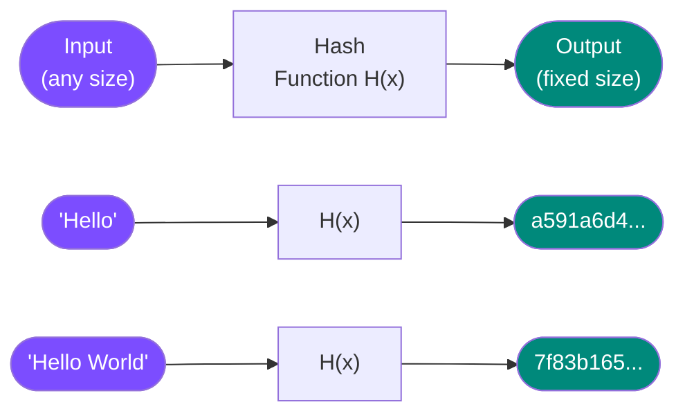
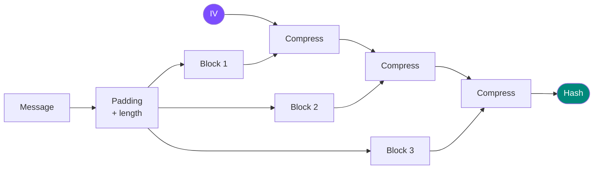
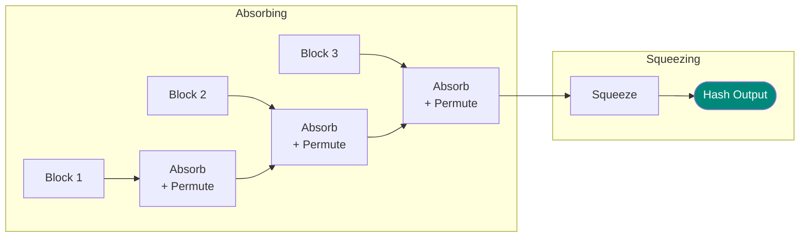
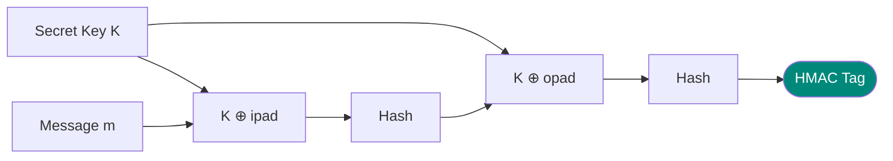

# Hash Functions

## What is a Hash Function?

A **cryptographic hash function** takes an input of arbitrary length and produces a **fixed-size output** (the hash or digest).



**Examples:**
- MD5: 128-bit output
- SHA-1: 160-bit output
- SHA-256: 256-bit output
- SHA-3: Variable output

---

## Properties of Cryptographic Hash Functions

### 1. Deterministic

Same input **always** produces same output.

$$H(\text{"Hello"}) = \text{"same hash every time"}$$

### 2. Fast to Compute

Should be efficient to compute hash for any input.

### 3. Pre-Image Resistance (One-Way)

Given hash $h$, it should be **computationally infeasible** to find any message $m$ such that:

$$H(m) = h$$

**Analogy:** Easy to scramble an egg, impossible to unscramble it.

---

### 4. Second Pre-Image Resistance (Weak Collision Resistance)

Given message $m_1$, it should be infeasible to find a different message $m_2$ such that:

$$H(m_1) = H(m_2)$$

**Prevents:** Attacker finding alternative message with same hash.

---

### 5. Collision Resistance (Strong Collision Resistance)

It should be infeasible to find **any two** different messages $m_1$ and $m_2$ such that:

$$H(m_1) = H(m_2)$$

**Prevents:** Attacker creating two messages with same hash.

---

### 6. Avalanche Effect

Changing **one bit** in the input should change **approximately half** the output bits.

**Example:**
```
H("Hello")  = a591a6d4...
H("Hella")  = c3d5e7f9...  (completely different!)
```

---

## Birthday Paradox & Collision Attacks

### The Birthday Problem

In a room of 23 people, there's a 50% chance two share a birthday.

**Why?** We're looking for **any collision**, not a specific match.

### Birthday Attack on Hash Functions

For an $n$-bit hash:
- **Brute force pre-image:** $2^n$ attempts
- **Find collision:** $2^{n/2}$ attempts (much easier!)

**Example:** SHA-256 (256 bits)
- Pre-image attack: $2^{256}$ attempts
- Collision attack: $2^{128}$ attempts

**Implication:** Hash must be twice as long as desired security level.

---

## Common Hash Functions

### MD5 (Message Digest 5)

**Output:** 128 bits  

!!! danger "BROKEN — Do not use!"
    Collisions found in 2004. Can generate collisions in seconds.

**Still used for:** Checksums (non-security), legacy systems

---

### SHA-1 (Secure Hash Algorithm 1)

**Output:** 160 bits  

!!! warning "DEPRECATED — Phase out!"
    Practical collision demonstrated in 2017 (Google's SHAttered attack).

**Transition:** Move to SHA-2 or SHA-3

---

### SHA-2 Family

**Variants:**
- SHA-224: 224 bits
- **SHA-256**: 256 bits (most common)
- SHA-384: 384 bits
- SHA-512: 512 bits

!!! success "SECURE — Widely used"

**Structure:** Merkle-Damgård construction

**Applications:**
- Bitcoin/blockchain
- TLS/SSL certificates
- Digital signatures
- Password hashing (with salt)

---

### SHA-3 (Keccak)

**Output:** Variable (224, 256, 384, 512 bits)  

!!! success "SECURE — Newest standard"

**Structure:** Sponge construction (different from SHA-2)

**Note:** SHA-3 is **not** a replacement for SHA-2, it's an alternative.

---

## Hash Function Structure

### Merkle-Damgård Construction (SHA-1, SHA-2)



**Vulnerability:** Length extension attacks

---

### Sponge Construction (SHA-3)



**Advantage:** No length extension attacks

---

## Applications of Hash Functions

### 1. Data Integrity

Verify files haven't been modified.

**Example:** Download verification
```bash
# Publisher provides: file.zip + SHA-256 hash
$ sha256sum file.zip
a591a6d4...  file.zip

# Compare with published hash
```

---

### 2. Password Storage

**NEVER store passwords in plaintext!**

Store $H(\text{password})$ instead.

**Login verification:**
1. User enters password
2. Compute $H(\text{password})$
3. Compare with stored hash

**Problem:** Rainbow tables (pre-computed hashes)

**Solution:** Add **salt** (random value)

$$H(\text{password} || \text{salt})$$

---

### 3. Digital Signatures

Sign the **hash** of a message, not the message itself.

$$\text{Signature} = \text{Sign}(H(\text{message}))$$

**Why?**
- Faster (hash is small)
- RSA can only sign limited data
- Ensures integrity

---

### 4. Proof of Work (Blockchain)

Find input such that hash has specific properties.

**Bitcoin mining:** Find nonce such that:

$$H(\text{block} || \text{nonce}) < \text{target}$$

Must start with certain number of zeros.

---

### 5. Commitment Schemes

Commit to a value without revealing it.

**Process:**
1. **Commit:** Publish $H(\text{value} || \text{nonce})$
2. **Reveal:** Show value and nonce
3. **Verify:** Others compute hash to confirm

---

## Message Authentication Codes (MAC)

### What is a MAC?

A **keyed hash** - ensures message came from someone with the secret key.

$$\text{MAC}_K(m) = \text{tag}$$

**Properties:**
- Requires secret key
- Provides **authentication** and **integrity**
- Does NOT provide confidentiality

---

### HMAC (Hash-based MAC)



$$\text{HMAC}_K(m) = H((K \oplus \text{opad}) \| H((K \oplus \text{ipad}) \| m))$$

**Why two hashes?**
- Prevents length extension attacks
- Stronger security proof

---

## Password Hashing

### BAD: Plain Hash

```python
# DON'T DO THIS!
password_hash = sha256(password)
```

**Problems:**
- Rainbow tables
- Same password → same hash
- Too fast (GPUs can try billions/second)

---

### BETTER: Hash + Salt

```python
salt = random_bytes(16)
password_hash = sha256(password + salt)
# Store: salt + password_hash
```

**Improvements:**
- Each user has different salt
- Rainbow tables won't work
- Still too fast

---

### BEST: Key Derivation Functions (KDF)

Use functions **designed** for password hashing:

**bcrypt:**
- Adjustable work factor
- Built-in salt
- Slow by design

**scrypt:**
- Memory-hard (GPU-resistant)
- Configurable parameters

**Argon2:**
- Winner of Password Hashing Competition
- Memory-hard
- Side-channel resistant
- Recommended for new systems

```python
import argon2

hasher = argon2.PasswordHasher()
hash = hasher.hash("my_password")
# Verify
hasher.verify(hash, "my_password")  # Returns True
```

---

## Attacks on Hash Functions

### 1. Brute Force

Try random inputs until hash matches.

**Defense:** Use long hash (256+ bits)

---

### 2. Birthday Attack

Find any collision (easier than pre-image).

**Complexity:** $O(2^{n/2})$ for $n$-bit hash

**Defense:** Hash must be 2× desired security level

---

### 3. Rainbow Tables

Pre-computed hash tables.

**Defense:** Use salts (makes tables impractical)

---

### 4. Length Extension Attack

For Merkle-Damgård hashes, given $H(m)$, can compute $H(m || m')$ without knowing $m$.

**Vulnerable:** MD5, SHA-1, SHA-2

**Defense:** Use HMAC or SHA-3

---

## Choosing a Hash Function

### For Integrity/Checksums:
- **SHA-256** (industry standard)
- SHA-3 (alternative)

### For Digital Signatures:
- **SHA-256** or SHA-512
- Match hash strength to signature key strength

### For Password Hashing:
- **Argon2** (best)
- bcrypt (good)
- scrypt (good)
- **NEVER** use MD5, SHA-1, or plain SHA-256

### For Blockchain/PoW:
- **SHA-256** (Bitcoin)
- Others use various algorithms

---

## Key Takeaways

1. **Hash functions** are one-way, fixed-size outputs
2. **Three main properties:** pre-image resistance, second pre-image resistance, collision resistance
3. **MD5 and SHA-1 are broken** - don't use for security
4. **SHA-256 is the standard** for most applications
5. **Birthday attack** makes collisions easier ($2^{n/2}$ vs $2^n$)
6. **Use salts** for password storage
7. **Use KDFs** (Argon2, bcrypt) not plain hashes for passwords
8. **HMAC** provides authenticated integrity